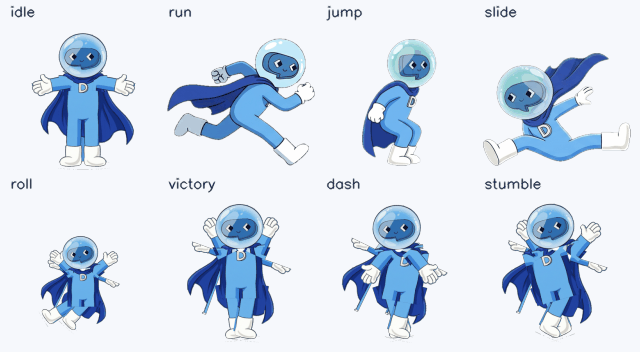

<div align="center">


# DiliRun

**A 2D Subway-Surfers-style endless runner, starring the Dliicom hero.**

Single player · score board · leaderboard · coin bar · v1.0.0

`main` = stable · `beta` = integration · zero runtime dependencies · ~12 KB of JS

[**▶ Play the current build**](https://levsage.github.io/DiliRun/) — no install, works on a phone
(add it to the home screen: the PWA manifest and icons are already wired up)

</div>



---

## What this is

An endless runner in the shape of Subway Surfers — three lanes, jump, slide, roll, coins, a speed
curve that never forgives you — built as a flat 2D canvas game with a **real animation rig**: the
uploaded hero illustration is segmented into eight articulated parts (helmet, torso, arms, legs, cape
panels), posed with keyframes, and baked into a sprite sheet. The Dliicom logo is used as uploaded and
drives the app icons, the HUD and the engraving on every coin.

| Requirement        | Where it lives                                                               |
| ------------------ | ---------------------------------------------------------------------------- |
| Hero = your upload | `assets/source/hero_source.png` → `tools/asset-pipeline` (rig config)        |
| Poses + animation  | `tools/asset-pipeline/dilirun_assets/poses.py` → 10 states / 55 frames       |
| Dliicom logo       | `assets/source/dliicom_logo.png` → `public/assets/ui`, `public/icons`, coins |
| Score board        | `src/ui/hud/ScoreBoard.ts`                                                   |
| Leaderboard        | `src/game/records.ts` + `src/ui/hud/LeaderboardPanel.ts`                     |
| Coin bar           | `src/ui/hud/CoinBar.ts`                                                      |
| Single player      | no network calls at runtime; `localStorage` only                             |

## Play with it

```bash
npm ci
npm run dev        # http://localhost:5173
```

The build currently boots into the **attract scene**: the rigged hero running on the track with the
live HUD (score board, coin bar, leaderboard). Keys `←/→/↑/↓` and `WASD` poke the hero, `Esc` pauses.

```bash
npm run dev -- --open "/?lab=1"   # pose bench: every baked animation, one button each
```

| Command                | What it does                                                       |
| ---------------------- | ------------------------------------------------------------------ |
| `npm run dev`          | Vite dev server                                                    |
| `npm run build`        | typecheck + production build into `dist/`                          |
| `npm run preview`      | serve `dist/` locally                                              |
| `npm test`             | vitest unit + asset-contract tests                                 |
| `npm run lint`         | eslint (flat config)                                               |
| `npm run check`        | typecheck + lint + tests + build — the CI gate                     |
| `npm run assets`       | regenerate every sprite from `assets/source/` and run the QA gates |
| `npm run assets:debug` | same, plus contact sheets and the docs GIF                         |

## Repository map

```
src/app/          composition root: boot, shell, scenes, pose lab
src/core/         loop · assets · storage · input · events · rng      (no game knowledge)
src/render/       canvas stage · sprite animator · perspective · theme
src/game/         scoring · records · data/{theme,balance}.json       (no DOM)
src/ui/           HUD: coin bar, score board, leaderboard panel
public/assets/    generated art + manifest.json (committed on purpose)
assets/source/    the two uploads: hero illustration + Dliicom logo
tools/asset-pipeline/  Python rig & baker (own README, own requirements)
docs/             plan · game design · architecture · assets · roadmap · deploying · contributing
```

Design docs are the source of truth for _why_: [PLAN](docs/PLAN.md) ·
[Game design](docs/GAME_DESIGN.md) · [Architecture](docs/ARCHITECTURE.md) ·
[Asset pipeline](docs/ASSETS.md) · [Roadmap & branches](docs/ROADMAP.md) ·
[Deploy](docs/DEPLOYING.md) · [Contributing](docs/CONTRIBUTING.md)

## The two rules that keep it organised

1. **Data, not code** — every colour lives in `src/game/data/theme.json`, every tuning number in
   `src/game/data/balance.json`. The Python pipeline reads the same theme file, so art and UI cannot
   drift apart.
2. **Art is generated, then committed** — `npm run assets` reproduces every sprite from
   `assets/source/`, and the build fails if the rig stops matching the uploaded drawing
   (rest-pose reconstruction IoU gate, currently **0.999**). Committed output means GitHub Pages needs
   no Python; CI re-runs the pipeline so a stale sheet cannot sneak in.

## Status

M0–M3 shipped: repo, asset pipeline + rig QA, engine primitives, game shell with the score board,
coin bar and leaderboard live on canvas. See [docs/ROADMAP.md](docs/ROADMAP.md) — **M4, the playable
run**, is next, and `docs/PLAN.md` §7 lists the four decisions the owner still owes.

CI is defined in [`docs/ci/`](docs/ci/README.md) and waiting to be moved into `.github/workflows/`:
GitHub rejects pushes that touch that folder unless the deploying token has the **Workflows** scope.

## Credits

Hero art and Dliicom logo: supplied for this project (`assets/source/`). Game, rig and pipeline:
DiliRun contributors. Genre reference: Subway Surfers (SYBO Games) — mechanics-inspired, no assets reused.

## License

See [LICENSE](LICENSE). Brand assets (Dliicom mark, hero design) are **not** licensed for reuse
outside this project.
